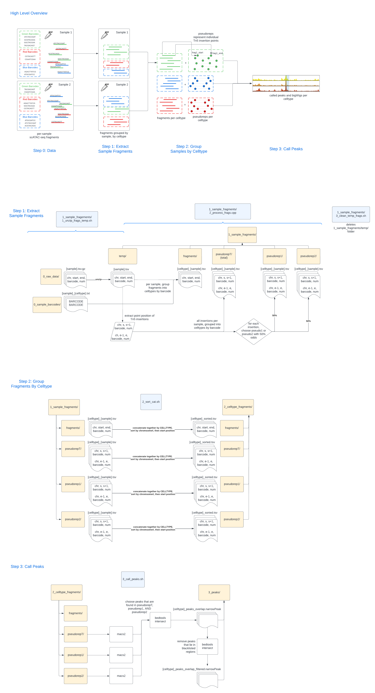

# Preprocess ATAC fragment for Chrombpnet snakemake pipeline
This is a snakemake pipeline. 


# Before Start
## Installation
create chrombpnet enviroment following https://github.com/kundajelab/chrombpnet

## Custom input and output
To apply to your computer, fill in the `config.yml` file with 
- frag_dir: path to original fragment files
- barcode_dir: path to input barcode_sample.txt 
- out_dir
- genome_dir

### Genome dir
Make genome dir in this structure:     
genome_dir
- hg38
    - fasta: "hg38.fa"
    - chrom_sizes: "hg38.chrom.sizes"
    - blacklist: "blacklist.bed.gz"
    - bias: "bias.h5"
    - chr_fold: "splits"
        - fold_0.json
        - fold_1.json
        - fold_2.json
        - fold_3.json
        - fold_4.json
- mm10
    - fasta: "mm10.fa"
    - chrom_sizes: "mm10.chrom.sizes"
    - blacklist: "mm10.blacklist2.bed" 
    - bias: "bias.h5"
    - chr_fold: "splits"
        - fold_0.json
        - fold_1.json
        - fold_2.json
        - fold_3.json
        - fold_4.json
# Start
** If on a PC or single node
```
snakemake -c $(nproc)
```
## Output
out_dir
- 1_sample_fragments
    - fragments
    - pseudorep1
    - pseudorep2
    - pseudorepT
- 2_celltype_fragments
    - fragments
        - {cell_type}_sorted.tsv # cell type-specific fragments 
    - pseudorep1
    - pseudorep2
    - pseudorepT
- 3_peaks
    - {cell_type}_peaks_overlap_filtered.narrowPeak # cell type-specific peaks
    - {cell type}_pval.bw
- 4_bigwig
    - {cell_type}_unstranded.bw 
- 5_union_peaks
    - union_peaks.narrowPeak


# Acknowledgements
Thanks Salil and Ryan for contributing the original preprocessing code.    
Please refer to https://github.com/kundajelab/scAnnot-to-chrombpnet for more details!